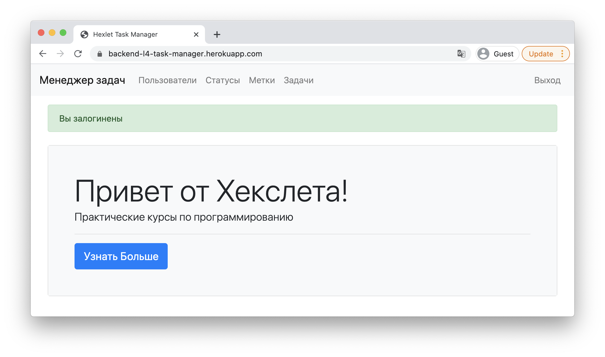
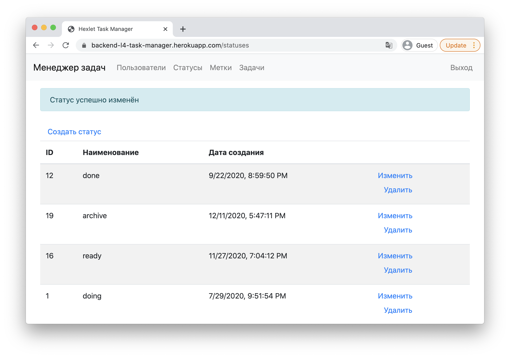
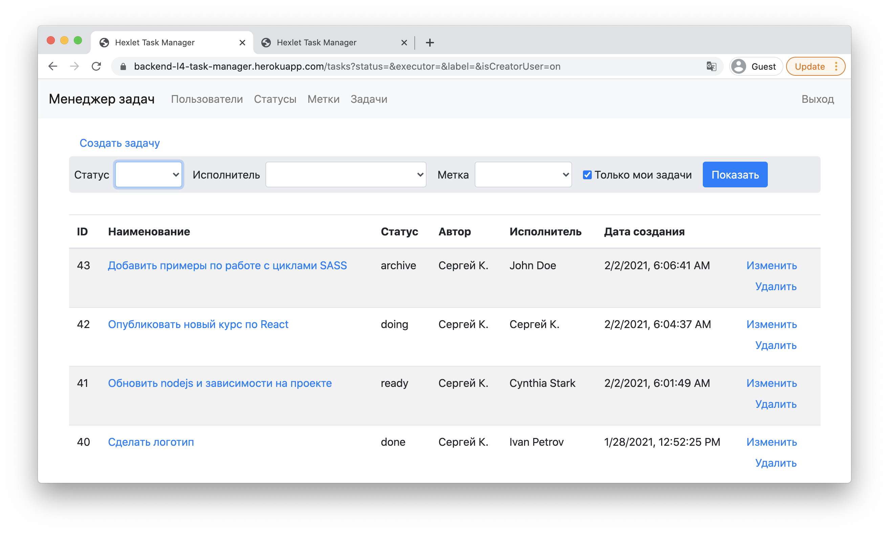

## Objetivo

🏁 Aprender a crear sitios web completos desde cero con tecnologías modernas es el motivo principal por el que llegas a Códica, y este proyecto final integra todo lo que has aprendido, abarcando aspectos clave del desarrollo web, como la configuración con Webpack y el despliegue.

En este proyecto, enfocamos en **crear entidades usando ORM** y en describir sus relaciones (_o2m, m2m_). Los estudiantes diseñarán modelos y su representación en la base de datos. Esto permite un nivel de abstracción mayor, trabajando no con datos en bruto, sino con conjuntos de objetos relacionados, accediendo fácilmente a las entidades dependientes.

Para automatizar más, el proyecto usa enrutamiento basado en recursos, lo que unifica y simplifica las operaciones CRUD. Así, se fomenta una buena estructura de URLs y su conexión.

Tan pronto como los usuarios pueden crear contenido en el sitio, surge la necesidad de autorización. La autorización es el proceso de dar permisos para ciertas acciones sobre los recursos y controlar su cumplimiento. Esto es clave cuando se intenta modificar elementos restringidos, como la configuración de otros usuarios. El mecanismo de autorización es esencial en una aplicación web y se cubre ampliamente en el proyecto.

Otra tarea común en el desarrollo web es crear formularios para filtrar datos. Con un mal enfoque, esta tarea puede volverse un código caótico. El proyecto permite practicar esta habilidad, usando la forma correcta de resolverla.

El funcionamiento del proyecto es tan importante como su desarrollo. El desarrollador necesita asegurarse de que su código funcione bien, y para esto escribe pruebas. Pero las pruebas no garantizan al 100% su funcionamiento, por lo que se necesita un sistema que rastree errores en producción y envíe alertas. Para esto, se usan recolectores de errores, como [Rollbar](https://rollbar.com), que recogen errores en tiempo real y envían la información a canales como Slack o correo electrónico. Este proyecto es una excelente oportunidad para practicar la integración de estos servicios.

## Descripción

Task Manager es un sistema de gestión de tareas, similar a [Redmine](http://www.redmine.org). Permite crear tareas, asignar responsables y cambiar sus estados. Para usar el sistema, es necesario registrarse y autenticarse.

